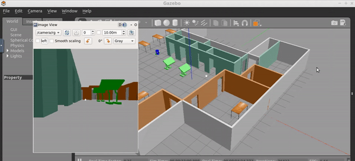

# Gazebo-Project

This project was developed for the course [Udacity Robotics Software Engineer Nanodegree Program](https://www.udacity.com/course/robotics-software-engineer--nd209).

Designed a simple robot with differential drive, lidar, and camera. Added nodes to process images from camera sensor and drive the robot to chase a spherical ball.

## Dependencies for Running Locally
* cmake >= 3.7
  * All OSes: [click here for installation instructions](https://cmake.org/install/)
* make >= 4.1 (Linux, Mac), 3.81 (Windows)
  * Linux: make is installed by default on most Linux distros
  * Mac: [install Xcode command line tools to get make](https://developer.apple.com/xcode/features/)
  * Windows: [Click here for installation instructions](http://gnuwin32.sourceforge.net/packages/make.htm)
* gazebo

## Basic Build Instructions

* Create a catkin_ws, feel free to skip if you already have one!

     $ cd /home/workspace/

     $ mkdir -p /home/workspace/catkin_ws/src/

     $ cd catkin_ws/src/

     $ catkin_init_workspace

     $ cd ..

* Clone the package in catkin_ws/src/

     $ cd /home/whttps://github.com/Agnibh/Go-Chase-It-.git

* Build the  package

     $ cd /home/workspace/catkin_ws/ 

     $ catkin_make

* After building the package, source your environment

     $ cd /home/workspace/catkin_ws/

     $ source devel/setup.bash

* Once the package has been built, you can launch the simulation environment using

     $ roslaunch my_robot world.launch

*Interact with the robot using the ball_chaser. Open a new terminal and type the following:

     $ cd /home/workspace/catkin_ws/

     $ source devel/setup.bash

     $ roslaunch ball_chaser ball_chaser.launch

* How to view image stream from the camera? Camera image stream is published to the following topic: /rgb_camera/image_raw
  This stream can be viewed by following command in separate terminal:

     $ rosrun image_view image_view image:=/rgb_camera/image_raw
